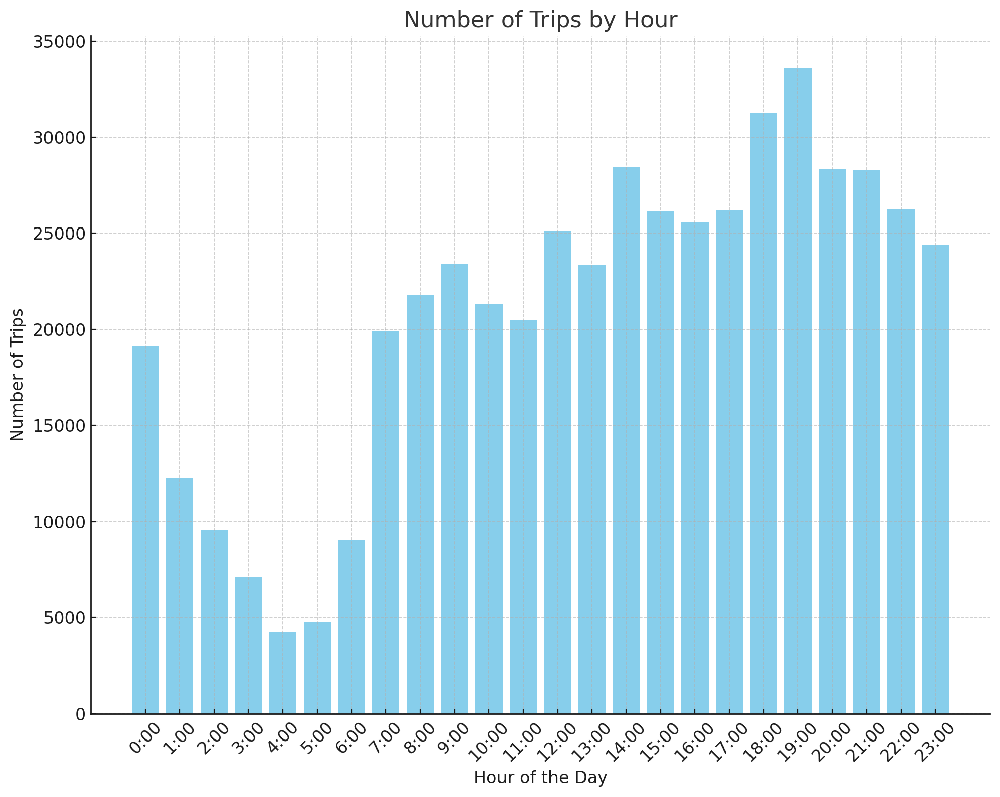
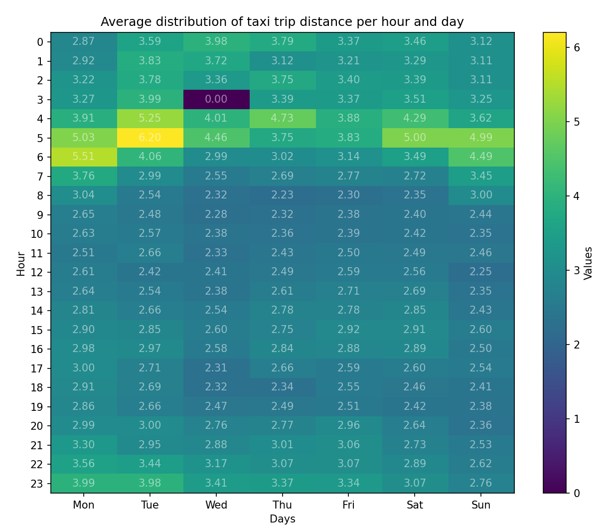

<h1 align="center">Traitement du graphe temporel CityBike avec Spark-GraphX</h1>
<h4 align="center">Mael KERICHARD - Cody ADAM</h4>
<p align="center">
   
   
</p>

- [Project](#project)
  - [Dataset Columns](#dataset-columns)
  - [Questions we want to answer](#questions-we-want-to-answer)
    - [Easy Question:](#easy-question)
      - [Results](#results)
      - [Observations](#observations)
    - [Medium Question:](#medium-question)
      - [Results](#results-1)
      - [Observations](#observations-1)
    - [Hard Question (Involving Spark-GraphX):](#hard-question-involving-spark-graphx)
      - [Results](#results-2)
      - [Observations](#observations-2)
  - [Results](#results-3)
  - [Generate the results](#generate-the-results)
    - [Requirements](#requirements)
    - [Start the project](#start-the-project)

# Project

In this projet we will be analyzing the [NYC Yellow Taxi Trip Data](https://www.kaggle.com/datasets/elemento/nyc-yellow-taxi-trip-data)

## Dataset Columns

| Field Name            | Description                                                                                                           |
| --------------------- | --------------------------------------------------------------------------------------------------------------------- |
| VendorID              | A code indicating the TPEP provider that provided the record.                                                         |
| tpep_pickup_datetime  | The date and time when the meter was engaged.                                                                         |
| tpep_dropoff_datetime | The date and time when the meter was disengaged.                                                                      |
| Passenger_count       | The number of passengers in the vehicle. This is a driver-entered value.                                              |
| Trip_distance         | The elapsed trip distance in miles reported by the taximeter.                                                         |
| Pickup_longitude      | Longitude where the meter was engaged.                                                                                |
| Pickup_latitude       | Latitude where the meter was engaged.                                                                                 |
| RateCodeID            | The final rate code in effect at the end of the trip.                                                                 |
| Store_and_fwd_flag    | This flag indicates whether the trip record was held in vehicle memory before sending to the vendor,                  |
| Dropoff_longitude     | Longitude where the meter was disengaged.                                                                             |
| Dropoff_latitude      | Latitude where the meter was disengaged.                                                                              |
| Payment_type          | A numeric code signifying how the passenger paid for the trip.                                                        |
| Fare_amount           | The time-and-distance fare calculated by the meter.                                                                   |
| Extra                 | Miscellaneous extras and surcharges. Currently, this only includes. the $0.50 and $1 rush hour and overnight charges. |
| MTA_tax               | 0.50 MTA tax that is automatically triggered based on the metered rate in use.                                        |
| Improvement_surcharge | 0.30 improvement surcharge assessed trips at the flag drop. the improvement surcharge began being levied in 2015.     |
| Tip_amount            | Tip amount - This field is automatically populated for credit card tips.Cash tips are not included.                   |
| Tolls_amount          | Total amount of all tolls paid in trip.                                                                               |
| Total_amount          | The total amount charged to passengers. Does not include cash tips.                                                   |

## Questions we want to answer

Based on the dataset columns from the NYC Yellow Taxi Trip Data, here we choosed three questions of varying difficulty that we will explore using Apache Spark and Spark-GraphX:

### Easy Question:

**"What are the peak hours for taxi demand in NYC?"**

- **Objective**: Identify the busiest hours during the day for taxi services.
- **Approach**: Aggregate `tpep_pickup_datetime` by hour and count the number of trips in each hour slot. Use Spark SQL for time-based aggregations.

#### Results

See [./results.md](results.md) for the results of the analysis.



#### Observations

The table showcases the distribution of taxi demand in NYC by the hour, providing valuable insights into the city's dynamics and lifestyle patterns. Here's an analysis based on the provided data:

1. **Late Night to Early Morning (0:00 - 5:00)**:
   - There's a notable decline in taxi demand during the late-night hours, reaching the lowest point around 4:00-5:00. This could be attributed to fewer people traveling after typical nightlife hours and before the morning rush.

2. **Morning Rush (6:00 - 9:00)**:
   - A significant surge in demand begins at 6:00, peaking between 8:00 and 9:00. This pattern aligns with typical morning commuting hours, as people head to work or school, leading to increased demand for taxi services.

3. **Midday (10:00 - 15:00)**:
   - Post morning rush, there's a slight dip in demand, but the numbers remain relatively high, suggesting a consistent need for taxis for midday activities like meetings, errands, or lunchtime travel.

4. **Afternoon to Early Evening (16:00 - 19:00)**:
   - Starting from 16:00, there's a resurgence in taxi demand, likely corresponding to the evening rush hour as people begin leaving work. The demand peaks at 19:00, making it the busiest hour for taxi services in the day. This could be due to a combination of commuters heading home and people going out for evening entertainment or dinner.

5. **Late Evening (20:00 - 23:00)**:
   - Post 20:00, there's a gradual decrease in demand, though the numbers stay relatively high, indicating ongoing activities around the city, including social gatherings, late work hours, or tourist activities.

6. **Strategic Insights for Service Providers**:
   - Taxi companies and ride-sharing services can optimize their fleet distribution based on these demand patterns. For instance, allocating more vehicles during peak hours (morning and evening rush hours and late evening) can help meet the high demand and improve service satisfaction.

7. **Urban Planning and Traffic Management**:
   - City planners and traffic authorities might use this data to manage traffic flow, plan for public transportation schedules, and make informed decisions about infrastructure development, like allocating special taxi lanes or pickup-dropoff zones during peak hours to alleviate congestion.

8. **Potential for Dynamic Pricing**:
   - Service providers might consider dynamic pricing strategies, where fares are adjusted based on demand. Higher fares during peak hours can moderate demand and compensate drivers for navigating through congested routes, while lower fares during off-peak hours might encourage people to use taxi services.

In conclusion, the data provides a clear depiction of the city's pulse, reflecting how the urban life cycle influences taxi demand. It's a crucial resource for service providers, city planners, and policy-makers for making informed decisions and improving urban mobility services.

### Medium Question:

**"How does the average trip distance vary by time of day and day of the week?"**

- **Objective**: Understand trip distance patterns in relation to the time of the day and the day of the week.
- **Approach**:
  - Extract hour and weekday from `tpep_pickup_datetime`.
  - Group data by the extracted hour and weekday, and then calculate the average `Trip_distance` for each group.
  - Analyze variations and trends in trip distance across different times of the day and days of the week.

#### Results

See [./results.md](results.md) for the results of the analysis.




#### Observations

The table provides a detailed breakdown of average trip distances by time of day and day of the week, offering valuable insights into travel patterns in the analyzed area. Several interesting patterns and trends can be deduced from the data:

1. **Variation by Time of Day**:

   - **Early Morning Hours (0-5 AM)**: There's a noticeable increase in average trip distances during the early morning hours. This trend might be due to several factors, such as people traveling longer distances after late-night events, early morning flights, or fewer short intra-city trips during these hours.
   - **Rush Hours (6-9 AM and 4-7 PM)**: During typical morning and evening rush hours, there's a fluctuation in average trip distances. This could be indicative of mixed travel patterns, with people commuting both short and long distances for work.
   - **Midday (10 AM - 3 PM)**: The trip distances tend to be shorter on average during these hours. It might reflect a higher frequency of intra-city travel for errands, meetings, or leisure activities.

2. **Day of the Week Influence**:

   - **Weekdays (Mon-Fri)**: The data shows consistent travel patterns during weekdays, with variations during rush hours and relatively shorter trips during midday hours.
   - **Weekends (Sat-Sun)**: The average trip distances on weekends, especially during early mornings, are generally longer compared to weekdays. This could be due to leisure or recreational activities, out-of-town trips, or the nightlife.

3. **Anomalies and Data Quality**:

   - There are some zero values (e.g., Wednesdays at 3-4 AM and 4-5 AM), which might indicate missing data, data collection issues, or genuinely no trips recorded during those hours. These anomalies should be further investigated for data quality and consistency.

4. **Late-Night to Early Morning Trend**:

   - There's a gradual increase in average trip distance from late night (around 11 PM) to early morning (till 5 AM), after which the distance starts to decrease as the city moves into morning rush hours. This might reflect a transition from nightlife-related travel to early morning work commutes or airport trips.

5. **Afternoon to Evening Transition**:

   - The increase in average trip distance from afternoon to evening might be related to people heading home from work or going out in the evening, involving longer travel distances compared to midday intra-city travel.

6. **Strategic Insights for Service Providers**:

   - Taxi companies and ride-sharing services can use this data to optimize their fleet distribution and availability to match the demand patterns, ensuring that enough vehicles are available during peak hours and in areas with longer average trip distances.

7. **Urban Planning and Traffic Management**:
   - City planners and traffic management authorities can leverage these insights for infrastructure development, traffic regulation, and public transportation planning, aiming to alleviate congestion during peak hours and ensure efficient transportation across the city.

In conclusion, this analysis not only sheds light on the temporal and weekly variations in travel patterns but also provides a data-driven foundation for decision-making for various stakeholders, including service providers, city planners, and traffic management authorities.

### Hard Question (Involving Spark-GraphX):

**"Can we identify communities/clusters of locations that are commonly connected through taxi trips?"**

- **Objective**: Discover clusters of locations that are frequently connected through taxi trips, which might indicate shared functional or social connections.
- **Approach**:
  - Construct a graph where nodes represent unique locations (geocoordinates rounded to a specific precision) and edges represent trips between these locations.
  - Use the pickup and dropoff latitude and longitude to define the nodes and the trips between these nodes as edges.
  - Apply graph clustering algorithms available in Spark-GraphX, like Label Propagation or Strongly Connected Components, to identify communities/clusters of locations.
  - Analyze the characteristics of these clusters, like their geographical spread, average trip distance, average fare, etc.

we aim to identify communities or clusters of locations that are commonly connected through taxi trips. We can use graph clustering algorithms available in Spark-GraphX, like Label Propagation or Strongly Connected Components, to identify these communities.

Below is the outline of the code to achieve this, with the focus on using the Label Propagation Algorithm (LPA) for community detection:

1. Objective and Approach Description: Describe the aim of the analysis and the method used.
2. Apply LPA: Use the Label Propagation Algorithm on the graph to identify communities.
3. Analyze Clusters: Aggregate data in the clusters, such as average trip distance, average fare, etc.
4. Generate Results: Format the results into a readable format.

#### Results

See [./results.md](results.md) for the results of the analysis.

#### Observations

The table provides a comprehensive overview of the identified communities or clusters of locations, as deduced from the taxi trip data using the Label Propagation Algorithm (LPA) in the Spark-GraphX framework. Here are some insights and observations based on the provided data:

1. **Community Sizes and Activity Levels**:

   - The number of trips (activity level) within each community varies significantly, indicating a wide disparity in the popularity or utilization of taxi services among different communities. For instance, the community with ID `-2082163804` has a remarkably high number of trips (716,100), suggesting it's a major hub or a highly frequented area. In contrast, several communities have a very low number of trips (as low as 1), which might indicate remote or less popular areas for taxi services.

2. **Average Trip Distance and Fare**:

   - There's a wide range in the average trip distances and fares across different communities. This variability could reflect the geographical characteristics of each community, the typical reasons for trips (e.g., commuting, tourism), and the traffic conditions.
   - For example, community `-314557922` has an exceptionally high average trip distance of 15.07 and a high average fare of 43.97, possibly indicating longer trips which might be to or from airports or between cities.
   - Conversely, communities with very low average trip distances and fares, like `996761836`, might represent areas where people take short, quick trips.

3. **Potential Outliers or Data Issues**:

   - Some entries, like community `-1464549559`, have a high average trip distance but a fare amount of 0.00. This could be indicative of data entry errors, free rides (possibly a promotion or a service error), or specific business models (e.g., subscription-based services).
   - Communities with a single trip, especially those with extreme values for distance or fare, should be investigated further as they could represent outliers or anomalies in the data.

4. **Community Characteristics**:

   - The data can be further enriched by integrating additional contextual information about the communities. For instance, mapping community IDs to specific geographical locations or points of interest can provide more meaningful insights into the nature of these communities and the reasons behind the observed patterns in trip distances, fares, and trip counts.
   - Furthermore, examining the time of day, day of the week, or season for the trips could also reveal important temporal patterns within and between communities, such as rush hour peaks, weekend vs. weekday differences, or seasonal tourism impacts.

5. **Data-Driven Decision Making**:
   - For transportation planners, city officials, and taxi service providers, this analysis is invaluable. It helps in understanding urban mobility patterns, optimizing service distribution, planning for future infrastructure, and tailoring services to meet the specific needs of different communities.
   - For example, communities with high activity levels but lower average trip distances might benefit from more efficient, small-capacity vehicles or alternative transportation modes like bike-sharing systems.

In conclusion, the table not only showcases the power of graph analytics in understanding complex networked data but also serves as a starting point for deeper, more contextual analyses to drive informed decision-making and policy planning.

Each of these questions increases in complexity, requiring more sophisticated data processing and analysis techniques. While the easy question involves basic data aggregation, the medium question adds the complexity of temporal data analysis. The hard question leverages the advanced graph processing capabilities of Spark-GraphX, enabling the exploration of complex relationships and patterns in the data.

## Results

Results are available here: [./results.md](results.md).

## Generate the results

### Requirements

- Java
- Scala
- SBT

### Start the project

```bash
sbt run
```

This will generate the results of the analysis in the `results.md` file.
